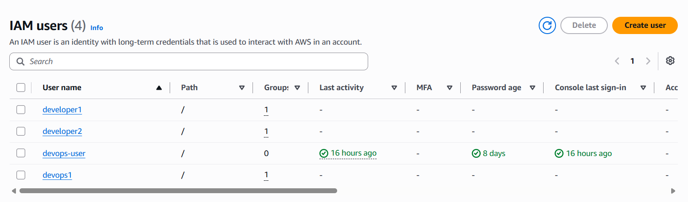
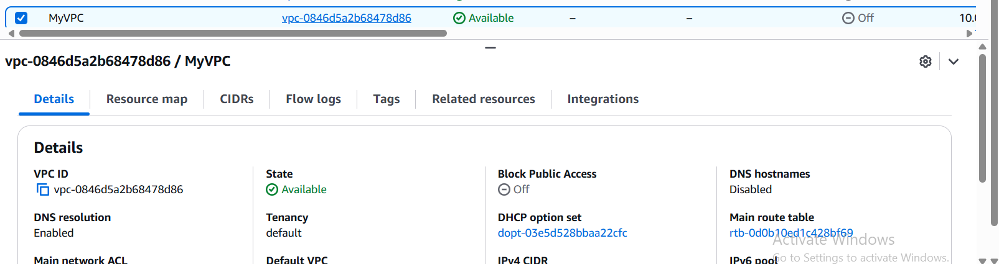
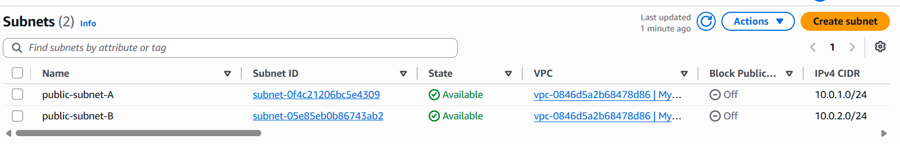
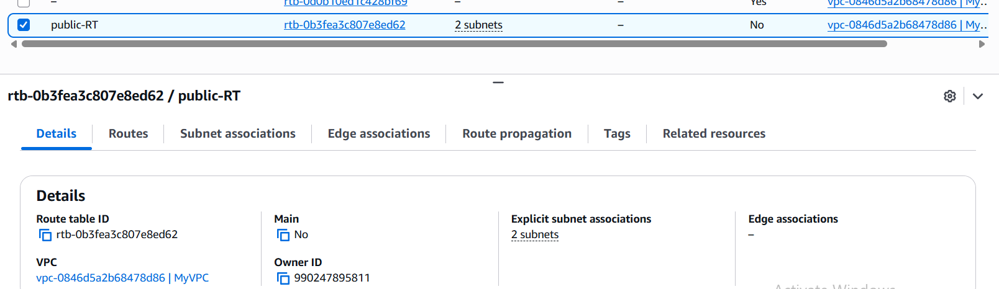
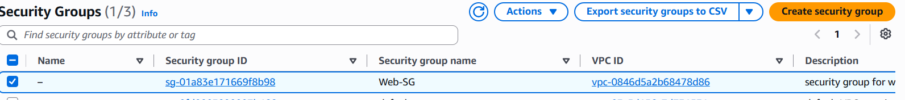
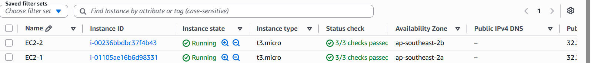
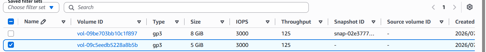
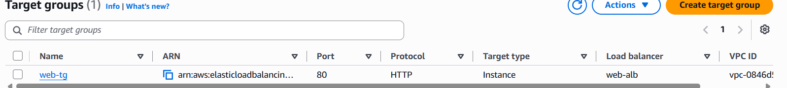
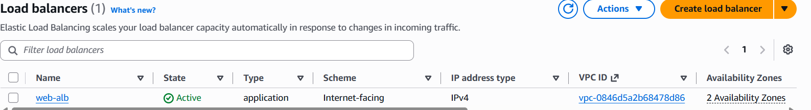
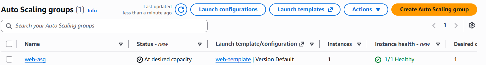

# AWS-Infrastructure-Assignment
## Project Overview

This project demonstrates the deployment of a highly available and fault-tolerant web application infrastructure on AWS Free Tier. The infrastructure was built using core AWS services including IAM, VPC, EC2, EBS, Application Load Balancer, and Auto Scaling Group. The project focuses on secure networking, load balancing, and high availability.

---
## Architecture

                 Internet
                     │
                     ▼
     Application Load Balancer
                     │
                     ▼
              Target Group
              │           │
              ▼           ▼
         EC2-1        EC2-2
        (Nginx)      (Nginx)
              │
              ▼
          EBS Volume

---

## Implementation

- Created IAM Users and Groups with appropriate permissions.
- Created a Custom VPC with two Public Subnets in different Availability Zones.
- Attached an Internet Gateway and configured Route Tables.
- Configured Security Groups for SSH and HTTP access.
- Launched two Amazon Linux EC2 instances.
- Installed and configured Nginx on both EC2 instances.
- Created and attached a 5 GB EBS volume to EC2-1.
- Created a Target Group and registered both EC2 instances.
- Configured an Internet-Facing Application Load Balancer.
- Created an Auto Scaling Group for automatic instance management.
- Performed failure testing to verify High Availability.

---
## Screenshots

### IAM
Created IAM users, groups, and assigned permissions.

### VPC
Created a custom VPC with CIDR 10.0.0.0/16.

### Public Subnets
Created two public subnets in different Availability Zones.

### Route Table
Configured internet routing using an Internet Gateway.

### Security Group
Configured SSH (22) and HTTP (80) inbound rules.

### EC2 Instances
Launched two Amazon Linux EC2 instances and installed Nginx.

### EBS Volume
Created, attached, and mounted a 5 GB EBS volume.

### Target Group
Registered both EC2 instances and verified healthy targets.

### Application Load Balancer
Configured an Internet-Facing Application Load Balancer.

### Auto Scaling Group
Configured Auto Scaling Group with Min:1, Desired:1, Max:2.

---

## Result

Successfully deployed a highly available and fault-tolerant web application infrastructure on AWS Free Tier. The Application Load Balancer distributed traffic across multiple EC2 instances, while Auto Scaling and Health Checks improved application availability and reliability.

---

## Author

*Taibanaz Khan*
